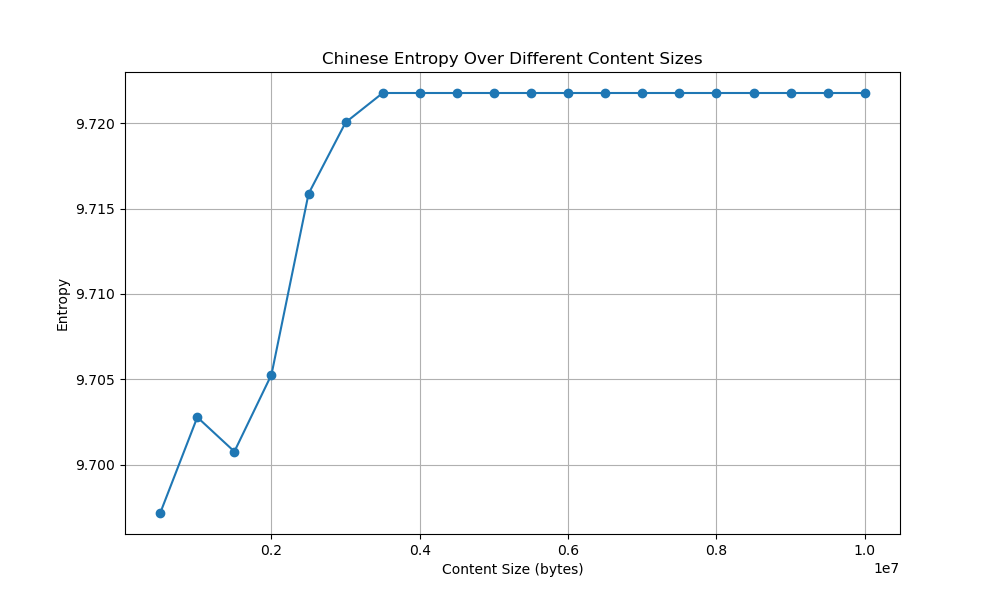
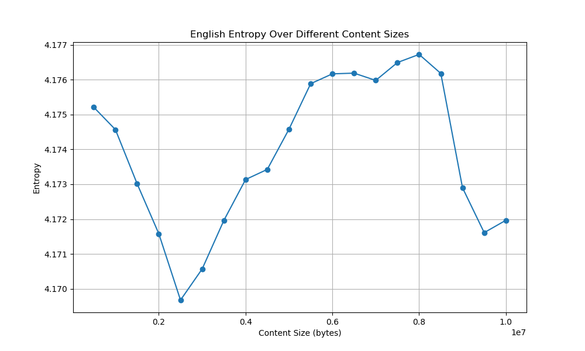

# 计算中英文信息源的熵

>学号：2021K8009915025
>姓名：徐天怿

## 数据来源

### 中文语料
来自新浪新闻：使用自制爬虫爬取

```python
# 定义函数：动态获取指定页面符合条件的链接
def solve(page):  
    """
    根据给定的页码page构造请求链接并发送GET请求，
    从响应中提取符合要求的新闻链接。
    
    参数：
    page (int): 需要抓取的页面编号
    
    返回值：
    urls (list): 包含新闻链接的列表
    """
    base_url = "https://feed.mix.sina.com.cn/api/roll/get?pageid=153&lid=2669&k=&num=50&page="
    suffix = "&r=0.7488014654950375&callback=jQuery1112025760955190502766_1604665024595&_=1604665024597"
    url = base_url + str(page) + suffix
    headers = {
      'authority': 'feed.mix.sina.com.cn',
      'user-agent': 'Mozilla/5.0 (Windows NT 10.0; Win64; x64) AppleWebKit/537.36 (KHTML, like Gecko) Chrome/86.0.4240.75 Safari/537.36',
      'accept': '*/*',
      'sec-fetch-site': 'same-site',
      'sec-fetch-mode': 'no-cors',
      'sec-fetch-dest': 'script',
      'referer': 'https://news.sina.com.cn/roll/',
      'accept-language': 'zh-CN,zh;q=0.9',
    }  # 设置请求头信息

    # 发送GET请求并获取响应
    response = requests.get(url, headers=headers)
    response.encoding = "utf-8"

    # 使用正则表达式提取新闻链接，同时将转义的斜线还原
    urls = [url.replace('\\/', '/') for url in re.findall(r'"url":"([^"]+)"', response.text)]
    
    return urls

# 定义函数：下载并写入新闻标题与内容到文本文件
def download_and_write(title, content, output_dir, file_count, total_news):
    """
    将新闻标题和内容写入到指定目录下的文本文件中，
    并按照每100条新闻分隔成不同的文件。
    
    参数：
    title (str): 新闻标题
    content (str): 新闻内容
    output_dir (str): 输出文件夹路径
    file_count (int): 当前写入文件的计数器
    total_news (int): 总新闻数量统计
    
    返回值：
    file_count (int): 更新后的文件计数器
    """
    # 创建用于保存新闻的文件名，并写入内容
    filename = f"{output_dir}/{file_count // 100:05d}.txt"
    with open(filename, 'a+', encoding='utf8') as file_object:
        # 格式化写入标题和内容
        file_object.write(f"{title}\n{content}\n\n")

    # 更新新闻总数和文件计数器
    total_news += 1
    file_count += 1

    # 每写入100条新闻时输出当前进度
    if file_count % 100 == 0:
        print(f'已完成{file_count}条新闻，已存储至文件：{filename}')
    
    return file_count

# 主函数入口
def main():
    """
    爬取新闻的主要流程，包括创建目标文件夹、循环抓取各页新闻及内容，
    并调用download_and_write函数将数据写入文件。
    """
    output_dir = '/Users/amber/Desktop/2024spring/nlp/hw1/data/new_zh_data'
    # 若目标文件夹不存在，则创建之
    if not os.path.exists(output_dir):
        os.makedirs(output_dir)

    total_news = 0
    file_count = 0
    # 循环遍历预设范围内的页面
    for page in range(1, 201):  # 假设总共有200页，每页50条新闻
        # 获取当前页面的所有新闻链接
        urls = solve(page)
        for each in urls:
            # 对每个新闻链接发送GET请求
            response = requests.get(each)
            soup = BeautifulSoup(response.content, 'lxml')

            # 提取新闻标题和正文内容
            title = soup.find("h1", class_="main-title").string.strip()
            content_tag = soup.find('div', class_="article")
            if content_tag is not None:
                content = ''.join([p.string for p in content_tag.findAll('p') if p.string])

                # 清理并标准化标题字符串
                clean_title = title.replace(':', '').replace('"', '').replace('|', '').replace('/', '').replace('\\', '').replace('*', '').replace('<', '').replace('>', '').replace('?', '')

                # 调用download_and_write函数写入新闻数据
                file_count = download_and_write(clean_title, content, output_dir, file_count, total_news)

# 执行主函数
if __name__ == '__main__':
    main()

```

### 英文语料
来自100部英文小说：从现有语料库下载

github链接：https://github.com/computationalstylistics/100_english_novels

## 数据清洗

中文语料和英文语料均进行了数据清洗，包括去除标点符号、去除换行符、去除多余空格等。特别注意的是，中文语料由于都是短小的新闻，所以把固定的“责任编辑：”和“消息来源：”也在清洗中删除了。

### 中文语料的清洗

```python
# 定义函数：清洗中文语料
def merge_files(src_folder, start_file, end_file, dest_file):
    with open(dest_file, 'w', encoding='utf8') as output_file:
        for i in range(start_file, end_file + 1):
            filename = f"{src_folder}/{i:05d}.txt"
            with open(filename, 'r', encoding='utf8') as input_file:
                output_file.write(input_file.read())

def clean_data(input_file, output_file):
    with open(input_file, 'r', encoding='utf8') as file:
        content = file.read()

        # 删除“责任编辑：（姓名）”
        content = re.sub(r"责任编辑：\（.*?）", "", content)

        # 去除“来源：（新闻来源）”
        content = re.sub(r"来源：\（.*?）", "", content)

        # 只保留汉字字符
        content = re.sub(r"[^\u4e00-\u9fa5]", "", content)

        with open(output_file, 'w', encoding='utf8') as output_file:
            output_file.write(content)
```

### 英文语料的清洗

```python
    # 使用 with open... as 语句打开源文件和目标文件
with open(source_file, 'r') as infile, open(target_file, 'w') as outfile:
    # 读取源文件的内容
    content = infile.read()
    # 使用正则表达式去除除了字母和空格以外的所有字符
    clean_content = re.sub('[^a-zA-Z ]+', '', content)
    # 将所有小写字母转化为大写字母
    upper_content = clean_content.upper()
    # 写回目标文件
    outfile.write(upper_content)
```
## 数据分析

包括计算频率、计算熵、绘图、存数据四个主要动作。下面以中文文本的数据分析为例：

```python
# 计算文本中每个字符的频率。
def calculate_frequency(text):
    freq_dict = {}
    for char in text:
        if char in freq_dict:
            freq_dict[char] += 1
        else:
            freq_dict[char] = 1
    return freq_dict

# 根据字符频率计算文本的熵。
def calculate_entropy(freq_dict, total_chars):
    entropy = 0
    for freq in freq_dict.values():
        probability = freq / total_chars
        entropy -= probability * math.log2(probability)
    return entropy

# 主函数：执行读文件、计算字符频率和熵，准备结果数据的过程。
def main():
    file_path = '/Users/amber/Desktop/2024spring/nlp/hw1/data/new_zh_data/cleannewzh.txt'
    result = []

    # sizes 数组定义了要分析的文本块的大小（以字节为单位），从 0.5M 开始，增加到 10M。
    sizes = [500_000 * (i + 1) for i in range(20)]

    for size in sizes:
        text = read_text(file_path, size)
        freq_dict = calculate_frequency(text)
        total_chars = sum(freq_dict.values())
        entropy = calculate_entropy(freq_dict, total_chars)
        top_chars = sorted(freq_dict, key=freq_dict.get, reverse=True)[:10]

        result.append({
            'size': size,
            'entropy': entropy,
            'top_chars': top_chars,
            'frequencies': [freq_dict[char] for char in top_chars]
        })

    return result

# 绘制不同内容大小下的熵值图，并将图表保存为图片。
def plot_entropy(analysis_result):
    sizes = [entry['size'] for entry in analysis_result]
    entropies = [entry['entropy'] for entry in analysis_result]

    plt.figure(figsize=(10, 6))
    plt.plot(sizes, entropies, marker='o')
    plt.title("Chinese Entropy Over Different Content Sizes")
    plt.xlabel("Content Size (bytes)")
    plt.ylabel("Entropy")
    plt.grid(True)
    plt.savefig('/Users/amber/Desktop/2024spring/nlp/hw1/result/zh_entropy_chart.png')
    plt.close()

# 将分析结果写入文件，包括熵、前 10 个字符及其频率。
def write_results_to_file(analysis_result, file_path):
    with open(file_path, 'w', encoding='utf8') as file:
        for entry in analysis_result:
            file.write(f"Size: {entry['size']} bytes\n")
            file.write(f"Entropy: {entry['entropy']}\n")
            file.write("Top 10 Characters: " + ', '.join(entry['top_chars']) + "\n")
            file.write("Frequencies: " + ', '.join(map(str, entry['frequencies'])) + "\n\n")


```

## 结论反思

### 结论

中文语料的熵值在 0.5M 到 10M 之间先增大到一定程度然后基本保持不变。



英文语料的熵值在 0.5M 到 10M 之间存在巨大震荡，原因未明。



中文文本中最常出现的汉字：


| Size (bytes) | Entropy | Top 10 Characters                |
|--------------|---------|----------------------------------|
| 500000       | 9.697   | 的, 一, 人, 在, 是, 有, 了, 不, 年, 中 |
| 1000000      | 9.703   | 的, 一, 人, 在, 是, 了, 有, 不, 年, 中 |
| 1500000      | 9.701   | 的, 一, 人, 在, 是, 了, 不, 有, 年, 中 |
| 2000000      | 9.705   | 的, 一, 人, 在, 是, 了, 不, 有, 年, 中 |
| 2500000      | 9.716   | 的, 一, 在, 人, 是, 了, 不, 有, 年, 上 |
| 3000000      | 9.720   | 的, 一, 在, 人, 是, 了, 不, 有, 年, 中 |
| 3500000      | 9.722   | 的, 一, 在, 人, 是, 了, 不, 有, 年, 中 |
| 4000000      | 9.722   | 的, 一, 在, 人, 是, 了, 不, 有, 年, 中 |
| 4500000      | 9.722   | 的, 一, 在, 人, 是, 了, 不, 有, 年, 中 |
| 5000000      | 9.722   | 的, 一, 在, 人, 是, 了, 不, 有, 年, 中 |
| 5500000      | 9.722   | 的, 一, 在, 人, 是, 了, 不, 有, 年, 中 |


英文文本中最常出现的字母：


| Size (bytes) | Entropy | Top 10 Characters |
|--------------|---------|-------------------|
| 500000       | 4.175   | E, T, A, O, N, I, H, S, R, D |
| 1000000      | 4.175   | E, T, A, O, I, N, S, H, R, D |
| 1500000      | 4.173   | E, T, A, O, I, N, S, H, R, D |
| 2000000      | 4.172   | E, T, A, O, N, I, H, S, R, D |
| 2500000      | 4.170   | E, T, A, O, N, I, H, S, R, D |
| 3000000      | 4.171   | E, T, A, O, N, I, H, S, R, D |
| 3500000      | 4.172   | E, T, A, O, N, I, H, S, R, D |
| 4000000      | 4.173   | E, T, A, O, N, I, H, S, R, D |
| 4500000      | 4.173   | E, T, A, O, N, I, H, S, R, D |
| 5000000      | 4.175   | E, T, A, O, N, I, H, S, R, D |
| 5500000      | 4.176   | E, T, A, O, N, I, H, S, R, D |


可以发现中文熵整体大于英文熵。


### 反思

没有采取多种类型的语料，中文语料仅摘取了短新闻，英文语料仅摘取了小说，应当采用更多类型的例子。

中文语料和英文语料的分析中均出现了熵值反常“震荡”的情况，本文并没有详细分析“震荡”的原因，有待进一步优化。
